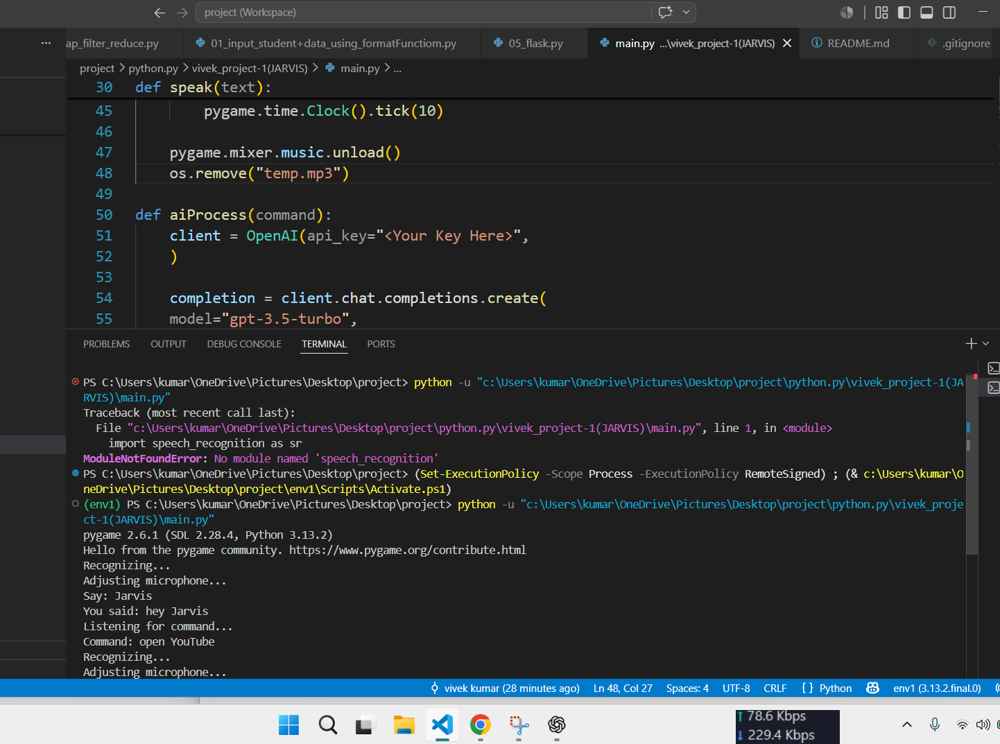

# Jarvis AI Voice Assistant

A Python-based voice assistant that can recognize speech, open websites, play music, read news, and answer questions using AI.


## What I Learned:

Hi Everyone,

This is one of my favorite Python projects. While building this voice assistant, I learned how to work with speech recognition, text-to-speech, APIs, web automation, and several Python libraries.

I also used ChatGPT as a learning tool whenever I got stuck or wanted to understand concepts better.It helped me understand new concepts, solve errors, and improve this project step by step.

## Demo

### Demo 1



### Demo 2


## Features

- Voice activation using "Jarvis"
- Open Google, YouTube, Facebook and LinkedIn
- Play songs from a custom music library
- Read the latest news (requires News API key)
- Answer general questions using OpenAI (requires OpenAI API key)
- Text-to-Speech response
- Speech Recognition using microphone

## Technologies Used

- Python
- SpeechRecognition
- gTTS
- pygame
- pyttsx3
- requests
- OpenAI API
- Webbrowser

## Installation

Clone the repository

```bash
git clone https://github.com/vivek6204712965/Jarvis-ai-voice-assistant.git
```

Install dependencies

```bash
pip install -r requirements.txt
```

Run the project

```bash
python main.py
```

## Note

This project requires:

- Internet connection
- Microphone
- OpenAI API Key
- News API Key

## Future Improvements

- Open desktop applications
- Weather updates
- WhatsApp automation
- AI conversation memory
- Better music search
- GUI version


## Author:

Vivek Kumar

B.Tech CSE (AI & ML)

Government Engineering College Kishanganj

GitHub: @vivek6204712965


## Project Status

This project is under active development. More features and improvements will be added in future updates.
